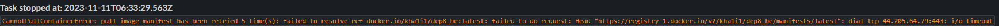
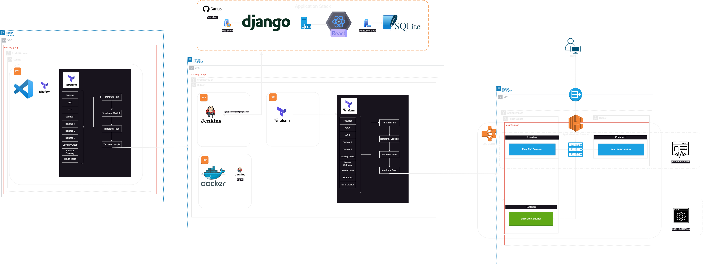
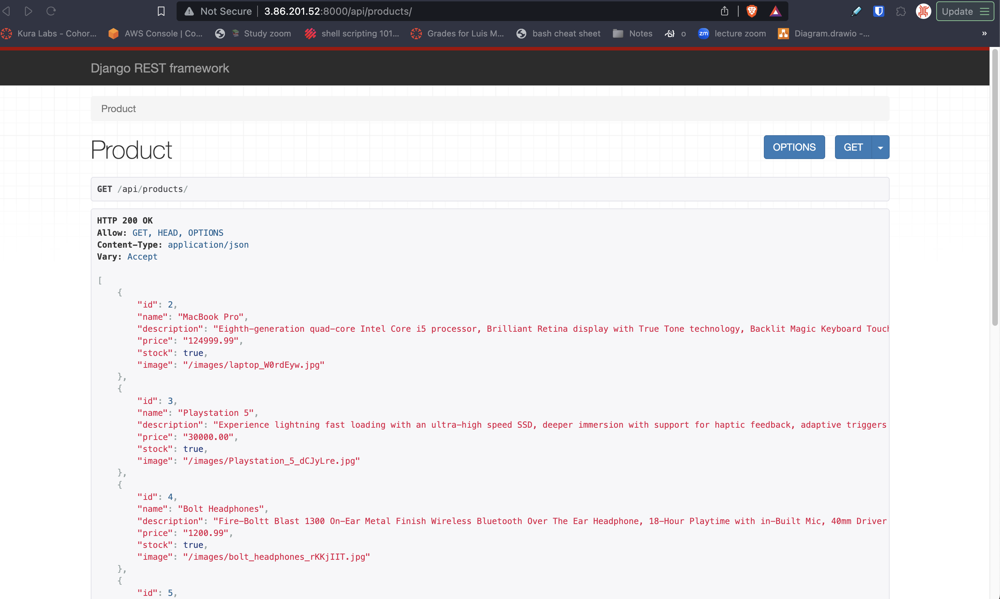
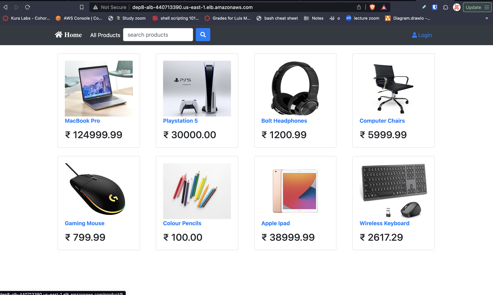
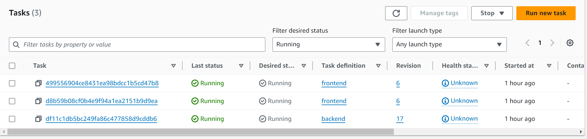
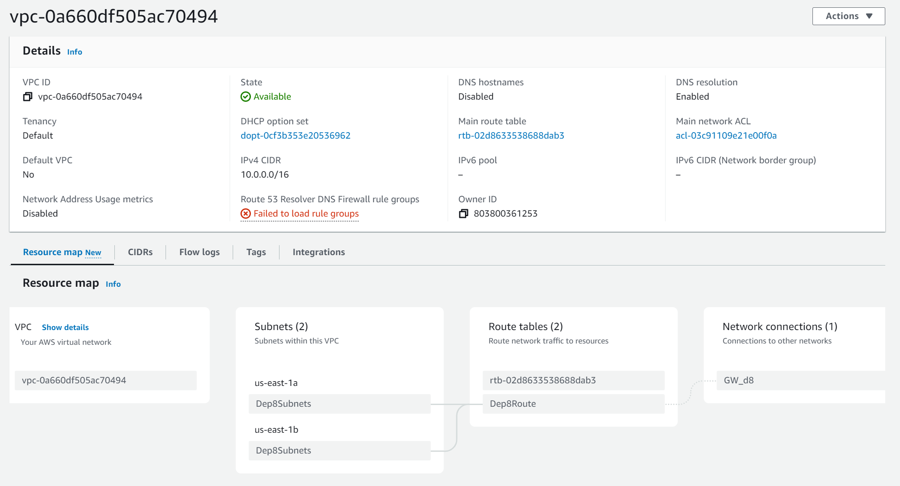

# Automated Terraform Deployment Documentation
Authors:
- System Administrator: Khalil 
- Project Manager: Luis
- Chief Architect: Ethan

## Purpose
This documentation provides an overview of deploying an E-commerce application stack. The deployment involves creating a Python script for sensitive information detection, setting up a Jenkins manager and agent architecture, and creating Terraform files for ECS and VPC. Additionally, Docker images for both the backend and frontend are created, and Jenkinsfiles are used to automate the deployment process.

## Issues

- **Error during ECS Task Definition Creation:**
  - Description: Encountered an issue creating the ECS Task Definition for the backend.
  - Resolution: Identified a problem with the IAM roles. Updated roles in the Terraform files to resolve the issue.

- **ALB Configuration:**
  - Description: Initially, the ALB did not have a listener configuration.
  - Resolution: Added an ALB listener in the Terraform configuration to properly route traffic.

- **Missing Service Definitions:**
  - Description: The Terraform files lacked service definitions for ECS.
  - Resolution: Added service definitions for backend and frontend ECS tasks to manage the deployment.
 
- **Missing a public IP for services**
  - Description: Tasks were failing because Docker images could not be pulled
  - Resolution: Assing public ip to services.
  - 
    
## System Diagram



### Step 1: Sensitive Information Detection Script
We created the Python Script and initial terraform files on an existing EC2 instance set up on a default VPC.
``` 
#!/usr/bin/python3

import logging
import sys
import re

logging.basicConfig(level=logging.INFO)
logger = logging.getLogger(" Credential Checker")

patterns = [
    re.compile(r'(?<!\S)["\']?[0-9a-zA-Z+/]{20}["\']?(?!\S)'),  # Matches any 20 character string with only alphanumeric characters and the characters + and /, optionally enclosed in quotes and directly surrounded by spaces or quotes
    re.compile(r'(?<!\S)["\']?[0-9a-zA-Z+/]{40}["\']?(?!\S)'),  # Matches any 40 character string with only alphanumeric characters and the characters + and /, optionally enclosed in quotes and directly surrounded by spaces or quotes
]


def contains_credentials(file_content):
    for pattern in patterns:
        if pattern.search(file_content):
            return True
    return False


def main():
    exit_code = 0
    files = sys.argv[1:]
    for local_file in files:
        try:
            with open(local_file, 'r') as f:
                logger.info(f" Checking {local_file} for credentials \n")
                file_content = f.read()
                if contains_credentials(file_content):
                    logger.warning(
                        f" Credentials detected in file: {local_file}"
                    )
                    exit_code = 1
                    for pattern in patterns:
                        matches = pattern.findall(file_content)
                        for match in matches:
                            logger.warning(
                                f" Credentials possible match: {match}"
                            )
        except UnicodeDecodeError:
            pass
        except FileNotFoundError:
            logger.error(f"File not found: {local_file}")

    return exit_code  # Return the exit code


if __name__ == "__main__":
    sys.exit(main())

```

### Step 2: Jenkins Manager and Agent Architecture
Set up a Jenkins manager and agent architecture with the following instances:

[(Working-Enviroment)main.tf](JenkinsTF/(Working-Enviroment)main.tf)

Instance 1:
- Jenkins with Docker pipeline plugin

 [JenkinsManagerInstall.sh](Bash-Scripts/JenkinsManagerInstall.sh) 

Instance 2 (T.2 medium):
- Docker
- Default-jre

[DockerInstall.sh](Bash-Scripts/DockerInstall.sh)

Instance 3:
- Terraform
- Default-jre

[TerraformInstall.sh](Bash-Scripts/TerraformInstall.sh)

### Step 3: ECS and VPC Terraform Files
Create Terraform files for ECS and VPC with the specified components:
- 2 AZ's
- 2 Public Subnets
- 2 Containers for the frontend
- 1 Container for the backend
- 1 Route Table
- Security Group Ports: 8000, 3000, 80
- 1 ALB

Terraform Files:
- [main.tf](TerraformFiles/main.tf)
- [VPC.tf](TerraformFiles/VPC.tf)
- [ECS-Frontend.tf](TerraformFiles/ECS-Frontend.tf)
- [ECS-Backend.tf](TerraformFiles/ECS-Backend.tf)

### Step 4: Backend Docker Image
Create a Docker image for the backend on a T.2 medium using the following steps:
```
# Python runtime as a base image
FROM python:3.9

# Set the working directory in the container
WORKDIR /app

# Clone Github repo into the container
RUN git clone https://github.com/elmorenox/c4_deployment-8.git

# Change the working directory to the 'backend' folder
WORKDIR /app/c4_deployment-8/backend

# Install the Python dependencies from requirements.txt
RUN pip install -r requirements.txt

# Run the Django database migration
RUN python manage.py migrate

# Expose port 8000 for the Django development server
EXPOSE 8000

# Start the Django development server 
CMD ["python", "manage.py", "runserver", "0.0.0.0:8000"]
```

### Step 5: Frontend Docker Image
Create a Docker image for the frontend on a T.2 medium using the following steps:
```
# Used Node.js runtime as a base image
FROM node:10

# Set the working directory in the container
WORKDIR /frontend

#copy cur dir to container
COPY . /frontend

# Install Node.js dependencies
RUN npm install 
RUN npm install --save-dev @babel/plugin-proposal-private-property-in-object

# Expose port 3000 for the Node.js application
EXPOSE 3000

# Start the Node.js application
CMD ["npm", "start"]
```

### Step 6: Jenkinsfiles
Create two Jenkinsfiles for deploying the backend and frontend ECS Terraform files:

Jenkinsfile_backend
```
pipeline {
    agent {
        label 'docker-build'
    }
    environment {
        DOCKERHUB_CREDENTIALS = credentials('morenodoesinfra-dockerhub')
    }
    stages {
        stage ('Test') {
            steps {
                sh '''#!/bin/bash
                python3.9 -m venv test
                source test/bin/activate
                pip install pip --upgrade
                pip install -r requirements.txt
                pip install mysqlclient
                pip install pytest
                py.test --verbose --junit-xml test-reports/results.xml /backend/account/tests.py /backend/product/tests.py
                '''
            }
            post {
                always {
                    junit 'test-reports/results.xml'
                }
            }
        }
        stage ('Build') {
            steps {
                sh 'docker build -t morenodoesinfra/d8-backend:latest -f Dockerfile.backend .'
            }
        }
        stage ('Login') {
            steps {
                sh 'echo $DOCKERHUB_CREDENTIALS_PSW | docker login -u $DOCKERHUB_CREDENTIALS_USR --password-stdin'
            }
        }
        stage ('Push') {
            steps {
                sh 'docker push morenodoesinfra/d8-backend:latest'
            }
        }
        stage ('Terraform') {
            when {
                branch 'main'
            }
            stages {
                stage('Init') {
                    agent {
                        label 'terraform'
                    }
                    steps {
                        withCredentials([
                            string(credentialsId: 'AWS_ACCESS_KEY', variable: 'aws_access_key'), 
                            string(credentialsId: 'AWS_SECRET_KEY', variable: 'aws_secret_key')
                        ]) {
                            dir('Terraform') {
                                sh 'terraform init' 
                            }
                        }
                    }
                }
                stage('Plan') {
                    agent {
                        label 'terraform'
                    }
                    steps {
                        withCredentials([
                            string(credentialsId: 'AWS_ACCESS_KEY', variable: 'aws_access_key'), 
                            string(credentialsId: 'AWS_SECRET_KEY', variable: 'aws_secret_key')
                        ]) {
                            dir('Terraform') {
                                sh 'terraform plan -out plan.tfplan -var="aws_access_key=$aws_access_key" -var="aws_secret_key=$aws_secret_key"' 
                            }
                        }
                    }
                }
                stage('Apply') {
                    agent {
                        label 'terraform'
                    }
                    steps {
                        withCredentials([
                            string(credentialsId: 'AWS_ACCESS_KEY', variable: 'aws_access_key'), 
                            string(credentialsId: 'AWS_SECRET_KEY', variable: 'aws_secret_key')
                        ]) {
                            dir('Terraform') {
                                sh 'terraform apply plan.tfplan' 
                            }
                        }
                    }
                } 
                stage('Destroy') {
                    agent {
                        label 'terraform'
                    }
                    steps {
                        script {
                            def user_response = input(
                                id: 'user_response', message: 'Do you want to Destroy?', 
                                parameters: [booleanParam(defaultValue: true, description: 'Check to destroy', name: 'destroy')]
                            )
                            if (user_response == true) {
                                withCredentials([
                                    string(credentialsId: 'AWS_ACCESS_KEY', variable: 'aws_access_key'),
                                    string(credentialsId: 'AWS_SECRET_KEY', variable: 'aws_secret_key')
                                ]) {
                                    dir('intTerraform') {
                                        sh 'terraform destroy -auto-approve -var="aws_access_key=$aws_access_key" -var="aws_secret_key=$aws_secret_key"'
                                    }
                                }
                            } else {
                                echo 'Skipping Destroy'
                            }
                        }  
                    }
                }
            }
        }
    }
}
```

Jenkinsfile_frontend
```
insert code here
```

### Step 7: Application Stack and API Server
The application stack consists of a Python Django backend and Node, React frontend deployed on a VPC hosting an ECS with an ALB. The backend serves as an API server running on port 8000.

### Step 8:

Backend API:


Frontend App, ALB:


Task Status:


VPC Infrastructure Resource Map:


### Conclusion
By following these steps, you will have successfully deployed the application stack using Terraform, Docker, and Jenkins. The Jenkins manager-agent architecture ensures automation in the deployment process, and the sensitive information detection script helps maintain security by preventing the inclusion of sensitive information in the GitHub repository.


